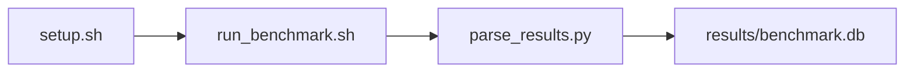

# CPU + System Stress (Baseline Health) Benchmark

[](LICENSE)
[](https://github.com/garys-gpu-benchmarks/303-sys-bench-amd-system-stress-stability-ubu2604/actions/workflows/ci.yml)

Target: Ubuntu 26.04 · AMD · see Hardware Requirements. This is a host benchmark, not a laptop `pip install` project.

## Quick Start

```bash
git clone https://github.com/garys-gpu-benchmarks/303-sys-bench-amd-system-stress-stability-ubu2604.git
cd 303-sys-bench-amd-system-stress-stability-ubu2604
sudo bash setup.sh --assume-yes
bash run_benchmark.sh --profile smoke --validate
```
Results are written to `results/benchmark.db` and `results/summary.json`.

This workload is executed on the validation host after the repository is copied there. `setup.sh` and `run_benchmark.sh` do not open an outbound SSH session.

Prerequisites: Ubuntu 26.04; AMD; Python 3.14.4; root or sudo for `setup.sh`. Framework: Bash, SQLite, Python, PyYAML, stress-ng, rocm-smi, amd-smi. This is a host benchmark, not a laptop `pip install` project.



## 1. Overview

Runs CPU-only stress-ng while polling rocm-smi/amd-smi once per second. num_threads: stress-ng --cpu workers (16). cpu_load_percent: stress-ng --cpu-load (50). duration: smoke 5 / baseline 200 / extended 580 s. Sweep dimensions: num_threads, cpu_load_percent, gpu_load_percent, temp_threshold, power_threshold, throttle_check, ecc_check, duration.

## 2. What It Validates

- Validates per-second telemetry during yaml duration. GPU GEMM load is not applied
- #1: Peak GPU junction temperature (peak_gpu_junction_temp_c); is present and physically sensible.
- #2: Sustained GPU power (sustained_gpu_power_w); is present and physically sensible.
- #3: GPU ECC error count (gpu_system_ecc_error_count); is present and physically sensible.
- #4: Thermal throttle events (thermal_throttle_event_count) is present and physically sensible.

## 3. Metrics Captured

- **#1: Peak GPU junction temperature** — stored as `peak_gpu_junction_temp_c`.
- **#2: Sustained GPU power** — stored as `sustained_gpu_power_w`.
- **#3: GPU ECC error count** — stored as `gpu_system_ecc_error_count`.
- **#4: Thermal throttle events** — stored as `thermal_throttle_event_count`.

## 4. Hardware Requirements

### Supported environment

- OS: Ubuntu 26.04
- GPU vendor: AMD
- Framework family: Bash, SQLite, Python, PyYAML, stress-ng, rocm-smi, amd-smi
- Python: Python 3.14.4

### Reference validation environment

The tables below describe the machine used to generate the reference results. They are not a requirement that every user buy that exact cloud instance.

### System

Ubuntu 26.04 / AMD / Bash, SQLite, Python, PyYAML, stress-ng, rocm-smi, amd-smi

### GPU

Ubuntu 26.04 / AMD / Bash, SQLite, Python, PyYAML, stress-ng, rocm-smi, amd-smi

## 5. Software Requirements

| Component | Version |
|---|---|
| OS | Ubuntu 26.04 |
| Kernel | kernel 7.0.0 |
| Python | Python 3.14.4 |
| ROCm | ROCm 7.14 |
| rocBLAS | rocBLAS 5.2.0 |

Runs CPU-only stress-ng while polling rocm-smi/amd-smi once per second. num_threads: stress-ng --cpu workers (16). cpu_load_percent: stress-ng --cpu-load (50).

## 6. Installation

```bash
Run stress-ng --cpu, rocm-smi and/or amd-smi metric, and sysfs power1_average
```

## 7. Running the Benchmark

```bash
Run stress-ng --cpu, rocm-smi and/or amd-smi metric, and sysfs power1_average
```

**Validating results separately:**

```bash
export BENCHMARK_PYTHON=/usr/bin/python3.13  # optional
python3 -m venv .venv
source ".venv/bin/activate"
".venv/bin/python" scripts/validate_results.py
```

## 8. Output

### `results/benchmark.db` (SQLite)

CSV with one time-series row per elapsed second

sample_index,second,gpu_util_pct,gpu_temp_c,gpu_power_w,ecc_uncorrected,peak_gpu_junction_temp_c,sustained_gpu_power_w,thermal_throttle_event_count,gpu_system_ecc_error_count
0,0,0,45,75,0,45,75,0,0

```bash
Run stress-ng --cpu, rocm-smi and/or amd-smi metric, and sysfs power1_average
```

### `results/summary.json`

Consolidated metrics from the most recent run — suitable for CI artifact upload or dashboard ingestion.

### `results/raw/<timestamp>.txt`

CSV with one time-series row per elapsed second

sample_index,second,gpu_util_pct,gpu_temp_c,gpu_power_w,ecc_uncorrected,peak_gpu_junction_temp_c,sustained_gpu_power_w,thermal_throttle_event_count,gpu_system_ecc_error_count
0,0,0,45,75,0,45,75,0,0

## 9. Baselines / Thresholds

Expected ranges and gates live in `config/benchmark_config.yaml` under `baselines:` or `thresholds:`. To update them, edit that file — never edit validation code directly.

## 10. Troubleshooting

**`setup.sh` missing collector**
Create cannot finish without `scripts/collect_workload.py`.

**`self_check` overlay rewritten**
Do not overwrite files listed in `results/overlay_lock.json`.

**Remote SSH drop during setup**
Reconnect and resume `bash setup.sh --assume-yes`. Do not wipe `.venv` or `.cache`.

## 11. NVIDIA H100 Coding Differences

Primary target is AMD ROCm. NVIDIA notes in this section are reference only and are not the execution path.

## Repository layout

```text
.
├── setup.sh
├── run_benchmark.sh
├── benchmark_specification.json
├── .github/workflows/      # thin CI callers (see Continuous Integration)
├── config/
├── scripts/
├── src/
├── tests/
├── docs/
├── results/
└── LICENSE
```

## Continuous Integration

| Workflow | Runs on | When | What it does |
|---|---|---|---|
| [CI](.github/workflows/ci.yml) | GitHub-hosted runner | every pull request, and every push to `main` | shellcheck, ruff, `bash -n`, `compileall`, `run_benchmark.sh --help`, specification schema, the results validator on a seeded fixture, required files, and actionlint. No GPU and no benchmark run. |
| [GPU Smoke Benchmark](.github/workflows/gpu-smoke.yml) | self-hosted runner labeled `gpu`, `amd`, `ubu2604` | only when started by hand: **Actions → GPU Smoke Benchmark → Run workflow** (choose `smoke`, `baseline` or `extended`) | Verifies the pre-provisioned GPU stack, records `results/environment.json` (driver, runtime, kernel, GPU), runs the profile with `--validate`, shows headline metrics on the run page, and uploads the results. |

Both files are short callers. The steps themselves live once, for every workload in the suite, in [`garys-gpu-benchmarks/shared-workflows`](https://github.com/garys-gpu-benchmarks/shared-workflows), pinned at `@v1`. The GPU workflow is never triggered by pull requests, so code from a fork cannot run on the GPU host.

### Running it as part of the AMD Ubuntu 26.04 bundle

This repository is one of the 32 workloads in [`bundle-amd-ubuntu-2604`](https://github.com/garys-gpu-benchmarks/bundle-amd-ubuntu-2604), which holds them as git submodules. To put the whole bundle on a GPU host and run this workload from it:

```bash
git clone --recurse-submodules https://github.com/garys-gpu-benchmarks/bundle-amd-ubuntu-2604 /opt/benchmarks
cd /opt/benchmarks/303-sys-bench-amd-system-stress-stability-ubu2604
bash run_benchmark.sh --profile smoke --validate
```
